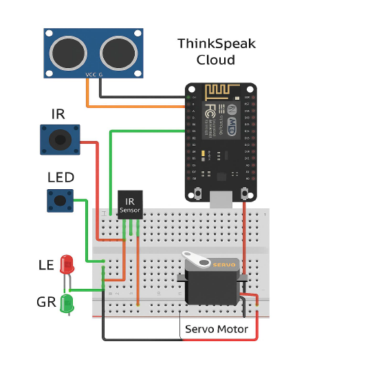

# Smart-car-parking-system-using-ESP8266
IoT-based Smart Parking System with slot reservation using ESP8266, ThingSpeak, and Web Dashboard 

Features:
- Detects slot occupancy using ultrasonic sensors
- Real-time data updates to ThingSpeak
- Servo motor-controlled gate with IR sensor
- Reservation system via web dashboard
- Local server dashboard with reservation buttons
- Auto-cancel reservation when car arrives

Technologies Used:
- ESP8266 (NodeMCU)
- Arduino C++
- ThingSpeak Cloud
- HTML, JavaScript (for local server dashboard)
- Servo, Ultrasonic Sensor, IR Sensor

Circuit Diagram:

Circuit Components:
- 2 x Ultrasonic Sensor (HC-SR04)
- 1 x IR Sensor
- 1 x Servo Motor
- NodeMCU ESP8266
- 4 x LEDs (for slot status)
- Jumper wires, breadboard

🚀 How to Run

1. Clone this repo and open `SmartParking.ino` in Arduino IDE
2. Install libraries:
   - ESP8266WiFi
   - ThingSpeak
   - Servo
   - ArduinoJson
3. Replace `ssid`, `password`, and ThingSpeak keys
4. Upload to ESP8266
5. Access dashboard via `http://<your_nodeMCU_ip>`

Dashboard:

